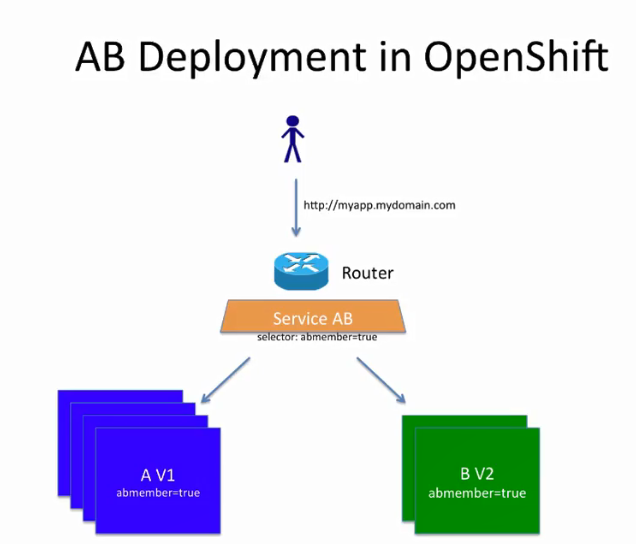

## Openshift AB DEPLOYMENT demonstration with a simple PHP Application

#### A/B Deployment
#### A/B deployments generally imply running two (or more) versions of the application code or application configuration at the same time for testing or experimentation purposes.

#### The simplest form of an A/B deployment is to divide production traffic between two or more distinct shards — a single group of instances with homogeneous configuration and code.

#### A/B deployments can be considered similar to A/B testing, although an A/B deployment implies multiple versions of code and configuration, where as A/B testing often uses one code base with application specific checks.

#### When to Use an A/B Deployment
#### When you want to test multiple versions of code or configuration, but are not planning to roll one out in preference to the other.

#### When you want to have different configuration in different regions.

#### An A/B deployment groups different configuration and code — multiple shards — together under a single logical endpoint. Generally, these deployments, if they access persistent data, should properly deal with N-1 compatibility (the more shards you have, the more possible versions you have running). Use this pattern when you need separate internal configuration and code, but end users should not be aware of the changes.

In this demo, we will check how to minimize the downtime of a Application while updating or running two version of the Application.   
create a common `service` and a common `route` for the pods, expose the pods by using common `service` & `route`

AB Deployment
`oc new-project abdeployment`

Create php app with out route and add  label  

`abgroupmember=true`

`app name = app-a`

`git url : https://github.com/venatrix/ab-demo.git`

`oc get dc`

`oc edit dc/app-a`

go to spec: > selector: > deploymentconfig:

add under `app-a`

`abgroupmember: "true"`

add new service

`oc expose dc/app-a --name=ab-service --selector=abgroupmember=true --generator=service/v1`

create route the service `ab-service`

`oc expose service ab-service --name=ab-route --hostname=<your url>`

scale replica
`oc scale dc/appp-a --replica=4`

To check the trafic
`while true;do curl <URL>; echo " "; sleep 1; done; `

edit index.ph from version 1 to 2

Create new php app with out route and add label abgroupmember=true

`app name = app-b`

Add Label `abgroupmember: "true"`

git url :` https://github.com/venatrix/ab-demo.git`

check with curl `while true;do curl <URL>; echo " "; sleep 1; done;`

